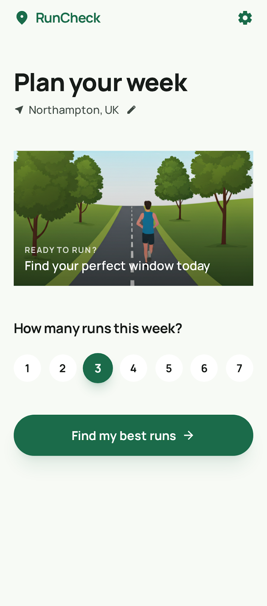
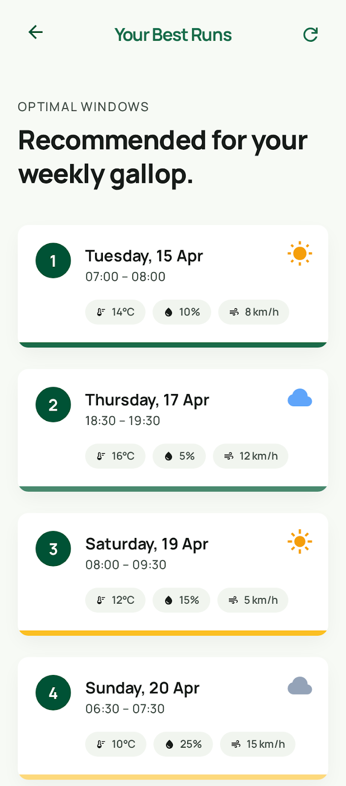
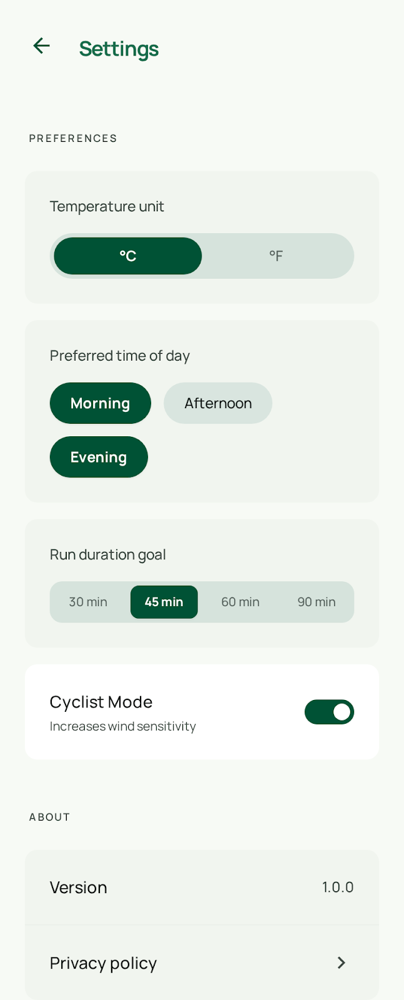

# RunCheck
_Weather-smart run scheduling for iOS & Android_


## Hero Description

RunCheck helps runners find the best times to run each week by analysing 7-day hourly weather forecasts. The user selects how many runs they want, and a scoring algorithm recommends optimal time slots based on temperature, precipitation, wind, and humidity. It was built as a solo side project with Flutter.

## Screenshots

<!-- Add screenshots here: home screen, results screen, settings screen -->

| Home | Results | Settings |
| --- | --- | --- |
|  |  |  |

## Overview

RunCheck is a mobile planning tool for people who want useful recommendations, not just raw weather data. Instead of asking the user to interpret a full forecast manually, the app narrows the week into a shortlist of practical running windows.

It combines product thinking with clean mobile engineering. The experience is intentionally simple: choose a location, set a weekly run target, and get ranked recommendations with enough context to make a decision quickly.

## Problem

Most weather apps are broad, but runners usually have a narrower question: _when should I run this week?_ That decision depends on several conditions at once, not a single temperature reading or rain icon.

I built RunCheck to answer that specific question clearly. The project focuses on turning noisy forecast data into a decision-ready schedule.

## Key Features

- 7-day hourly forecast analysis using Open-Meteo weather data
- Recommended run windows ranked by a custom multi-factor scoring system
- Adjustable weekly run target from the home screen
- Preference-aware scheduling for morning, afternoon, or evening runs
- Run duration settings for 30, 45, 60, or 90 minutes
- Celsius and Fahrenheit support
- Cyclist mode to increase wind sensitivity
- Cached forecast fallback when fresh network data is unavailable
- Dedicated results and settings flows with polished in-app transitions

## How It Works

The scheduling engine filters forecast hours by the user’s preferred time of day and available daylight. It then builds valid multi-hour windows based on the selected run duration, scores each window, and greedily selects the strongest options while enforcing spacing between runs.

That scoring model weights four factors that matter most for outdoor comfort: temperature, precipitation probability, wind speed, and humidity. The result is a ranked set of time slots that feels opinionated and useful, not random.

## Product Decisions

I chose to keep the flow short and high-confidence. The app asks for only the information needed to generate a schedule, then presents recommendations in a format that is easy to scan on mobile.

I also built in stale-cache handling so the experience remains resilient when the forecast API fails. That trade-off matters in a real product: it is often better to show slightly older data with a clear disclaimer than to show nothing at all.

## Tech Stack

- Flutter for the cross-platform UI layer
- Dart for application logic and scheduling
- Riverpod for state management
- GoRouter for navigation
- HTTP for API requests
- Hive for weather caching
- SharedPreferences for user settings persistence
- Geolocator and Geocoding for location support

## Architecture

The project is organised around a clear separation of concerns. Screens handle presentation, providers manage state and orchestration, services handle data access and business logic, and models keep application data explicit and testable.

That structure keeps the scheduling logic independent from Flutter widgets. The core run recommendation engine lives in pure Dart, which makes it easier to reason about, validate, and extend.

## Project Structure

```text
lib/
├── models/       # Forecast, location, preferences, and scheduling data
├── providers/    # Riverpod state and orchestration
├── screens/      # Home, results, and settings views
├── services/     # Weather, location, cache, and scheduling services
├── utils/        # Theme, router, constants, spacing, and helpers
└── widgets/      # Reusable UI components
```

## Running Locally

### Prerequisites

- Flutter SDK 3.41.2
- Dart SDK 3.11.0
- Xcode for iOS builds
- Android Studio and Android SDK for Android builds

### Setup

```bash
flutter pub get
flutter analyze
flutter test
```

### Launch

```bash
flutter run -d ios
flutter run -d android
```

## What This Project Demonstrates

- Product framing around a specific user need
- Practical algorithm design for recommendation-based UX
- Cross-platform Flutter delivery with a considered mobile interface
- State management and persistence choices that fit a small but real app
- Attention to resilience through caching, error handling, and sensible defaults

## Future Improvements

- Add visual forecast explanations for why each slot scored well
- Introduce route-aware recommendations based on terrain or exposure
- Expand test coverage around scheduling edge cases and provider flows
- Add screenshot assets and short demo video for richer repository presentation
- Publish a privacy policy and formal MIT license file for public release

## Author Note

RunCheck was built as a solo side project to explore the space between utility software and thoughtful product design. I used it to demonstrate that even a focused mobile app can show strong judgement in UX, architecture, and algorithm design when the scope is tight and the problem is clear.

## License

This project is intended to be released under the MIT License.
